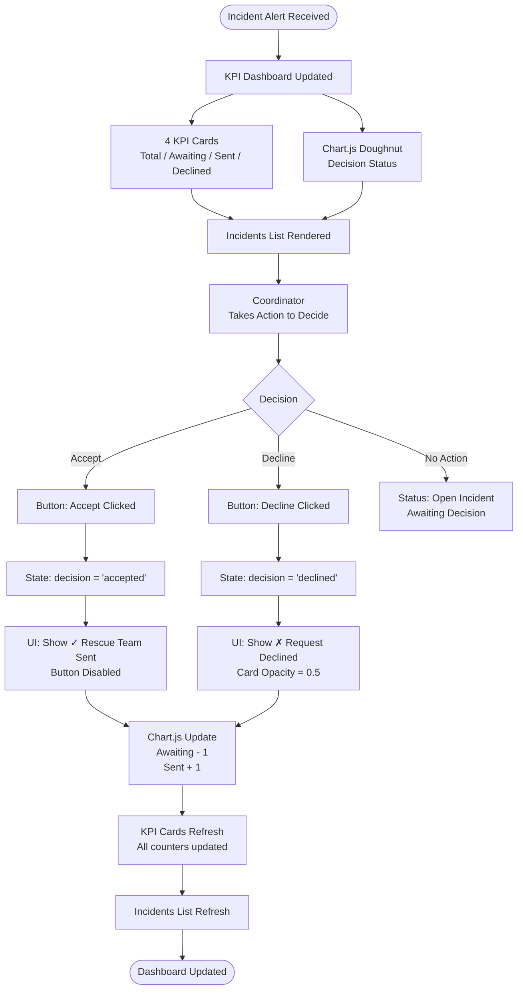

# Rescue Coordinator - System Flowchart

## Data Flow

**Incident Object:**
- id, name, hazard, threat, location, time, decision

**KPI Calculation:**
- Total = all incidents
- Awaiting = decision === null
- Sent = decision === 'accepted'
- Declined = decision === 'declined'

**Chart Data:**
- [Awaiting, Sent, Declined]
- Colors: Gray / Green / Red
- Type: Doughnut (Chart.js Library)

## Meaningful Extension: Chart.js Library

The Chart.js library provides:
- Real-time chart updates
- Doughnut/pie visualization
- Responsive rendering
- Dynamic data binding

Without this library, the decision status would only be text-based. With Chart.js, the coordinator gets visual feedback immediately.
